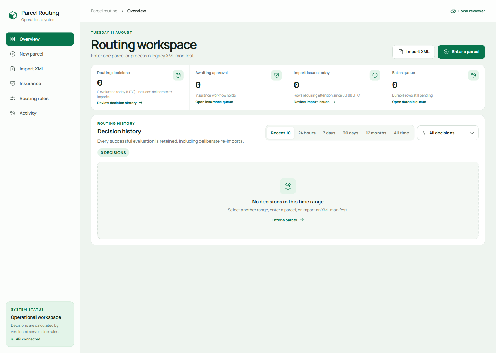

# Parcel Routing System

A secure full-stack operations console for deterministic parcel routing,
privacy-safe XML imports, insurance approval, and versioned rule management.

Built by [Srimaan Shreyas Vemula](https://github.com/shrimaanshreyash) as a
portfolio project focused on explainable domain logic, secure boundaries, and
production-minded local operations.



## Why this project matters

Parcel routing looks simple until boundary rules, retries, legacy data,
authorization, and historical explainability meet. This system treats those as
first-class engineering concerns:

- the browser never calculates a route;
- every decision records its matched rules and immutable rule-set version;
- insurance is an independent approval hold, not a routing department;
- duplicate imports require explicit confirmation without deduplicating people;
- malformed rows are isolated so valid rows can continue;
- production authentication cannot fall back to the local reviewer identity.

## Routing policy

The active default rule set is version 1:

| Condition | Outcome |
| --- | --- |
| Weight up to and including 1 kg | Mail |
| Weight above 1 kg and up to 10 kg | Regular |
| Weight above 10 kg | Heavy |
| Declared value above EUR 1,000 | Insurance approval required |

Destination country is required as an ISO code but does not change the default
department. Rule versions can be drafted, validated, simulated, activated,
monitored, rolled back, and audited.

## Privacy-safe XML processing

The streaming XML adapter accepts both the legacy `Receipient` element and the
corrected `Recipient` spelling. Recipient names and addresses are discarded at
the parser boundary: they are not returned to the application layer, persisted,
logged, or used for deduplication.

The parser disables DTDs and external entities and enforces limits for upload
bytes, XML characters, row count, numeric ranges, and processing time. Nine
privacy-safe fixtures cover valid boundaries, variations, row errors, invalid
countries, malformed XML, unsupported structures, XXE, and duplicate retries.

## Architecture

```text
React operator console
        |
Unprivileged Nginx same-origin proxy
        |
ASP.NET Core API
        |
Application use cases
       / \
Pure routing domain   Infrastructure adapters
                            |
                       PostgreSQL
```

The solution is a modular monolith with inward-pointing dependencies. The pure
domain has no dependency on ASP.NET Core, EF Core, PostgreSQL, React, XML, or
network concerns.

### Technology

- .NET 10, ASP.NET Core, EF Core, PostgreSQL 17
- React 19, TypeScript, Vite, unprivileged Nginx
- xUnit unit and integration tests
- Docker Compose reviewer workflow
- OIDC/JWT production authentication boundary

See [Architecture](docs/ARCHITECTURE.md),
[architecture diagrams](docs/interview/ARCHITECTURE_DIAGRAMS.md), and the
[accepted ADRs](docs/adr/).

## Run locally

Prerequisites: Docker Desktop with Linux containers and port `8190` available.

```powershell
$env:PARCEL_ROUTING_POSTGRES_PASSWORD = '<choose-a-local-password>'
docker compose -f .\ops\compose.yaml up --detach --build
docker compose -f .\ops\compose.yaml ps
```

Open [http://127.0.0.1:8190](http://127.0.0.1:8190).

Verify the packaged application:

```powershell
Invoke-WebRequest -UseBasicParsing http://127.0.0.1:8190/health/live
Invoke-WebRequest -UseBasicParsing http://127.0.0.1:8190/health/ready
```

Stop and remove the local stack, including its disposable database volume:

```powershell
docker compose -f .\ops\compose.yaml down --volumes --remove-orphans
```

See the [operations guide](ops/README.md) for restart, migration, recovery, and
production-configuration boundaries.

## Verify from source

```powershell
dotnet restore .\ParcelRoutingSystem.slnx --locked-mode
dotnet format .\ParcelRoutingSystem.slnx --no-restore --verify-no-changes
dotnet build .\ParcelRoutingSystem.slnx `
  --configuration Release --no-restore --warnaserror
dotnet test .\ParcelRoutingSystem.slnx `
  --configuration Release --no-build --no-restore
dotnet list .\ParcelRoutingSystem.slnx package `
  --vulnerable --include-transitive

Set-Location .\src\ParcelRoutingSystem.Web
npm ci
npm run typecheck
npm run lint
npm run build
npm audit --omit=dev --audit-level=moderate
npm audit --audit-level=moderate
```

The current verification baseline is 139 automated tests: 55 domain, 31
application, 19 infrastructure/XML/PostgreSQL, and 34 API/security tests. See
the [verification record](docs/evidence/FINAL_VERIFICATION.md) for the complete
gate and honest limitations.

## Repository map

```text
.
|-- docs/                       Architecture, security, ADRs and evidence
|-- ops/                        Docker reviewer and production overlays
|-- src/
|   |-- ParcelRoutingSystem.Api/
|   |-- ParcelRoutingSystem.Application/
|   |-- ParcelRoutingSystem.Domain/
|   |-- ParcelRoutingSystem.Infrastructure/
|   `-- ParcelRoutingSystem.Web/
|-- tests/                      Unit, integration and XML fixture coverage
`-- ParcelRoutingSystem.slnx
```

## Authentication and deployment boundary

The local Compose workflow uses a Development-only `Local reviewer` identity
with Operator, InsuranceApprover, and RuleAdministrator roles so the complete
workflow can be evaluated without creating first-party accounts.

Production mode requires an external OIDC/JWT authority, audience, token flow,
and role mapping. This repository does not claim a deployed identity provider,
public cloud deployment, production telemetry service, full WCAG conformance,
or environment-specific load/soak results.

## Documentation

- [Requirement traceability](docs/REQUIREMENTS.md)
- [Routing-rule design](docs/RULE_SYSTEM.md)
- [Security and reliability baseline](docs/SECURITY_RELIABILITY.md)
- [Security review](docs/SECURITY_REVIEW.md)
- [UX guidelines](docs/UX_GUIDELINES.md)
- [Verification record](docs/evidence/FINAL_VERIFICATION.md)
- [AI-assisted development record](docs/ai/AI_USAGE_LOG.md)
- [Demo walkthrough](docs/interview/DEMO_WALKTHROUGH.md)
