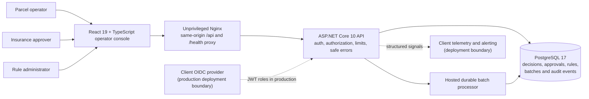
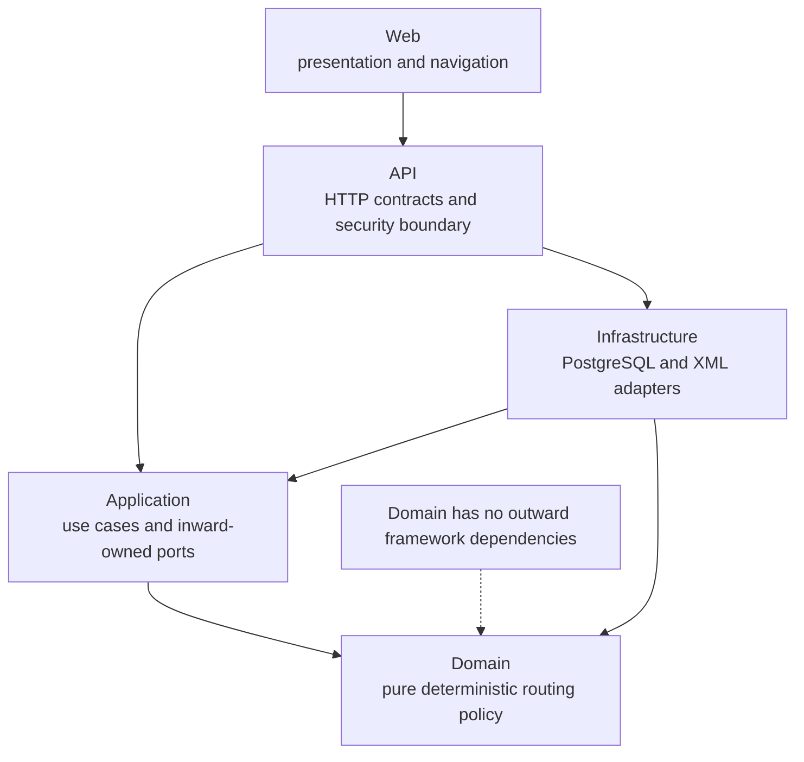
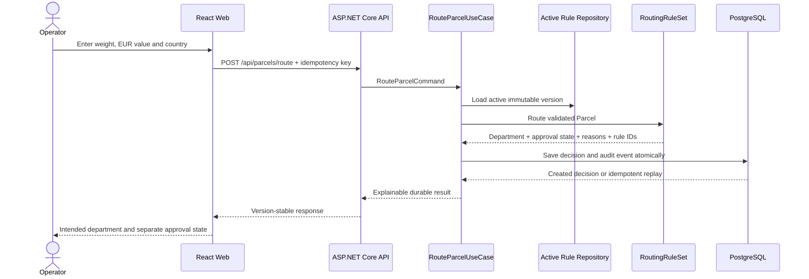
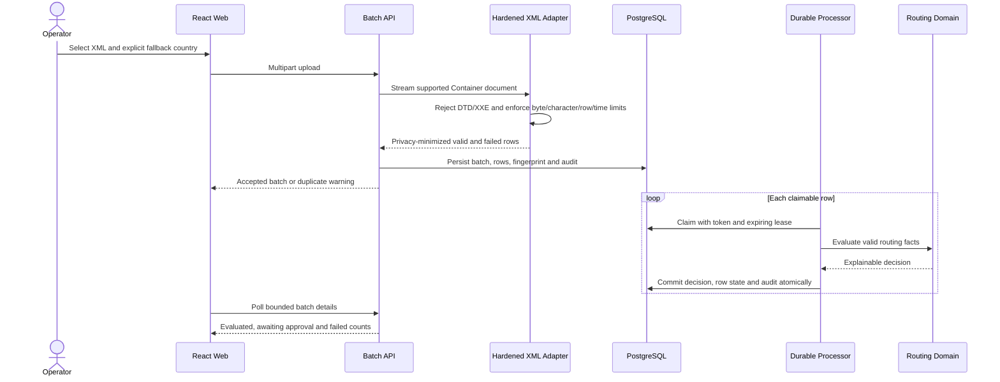
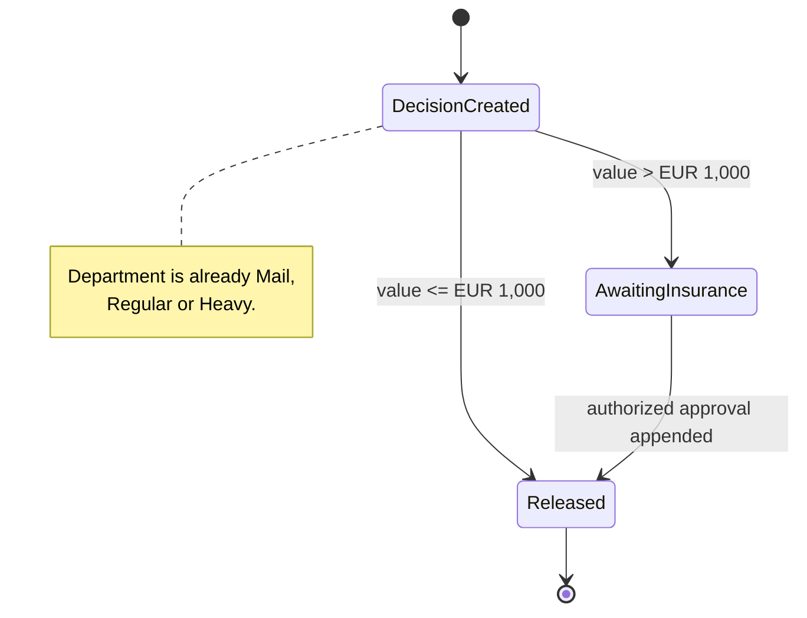
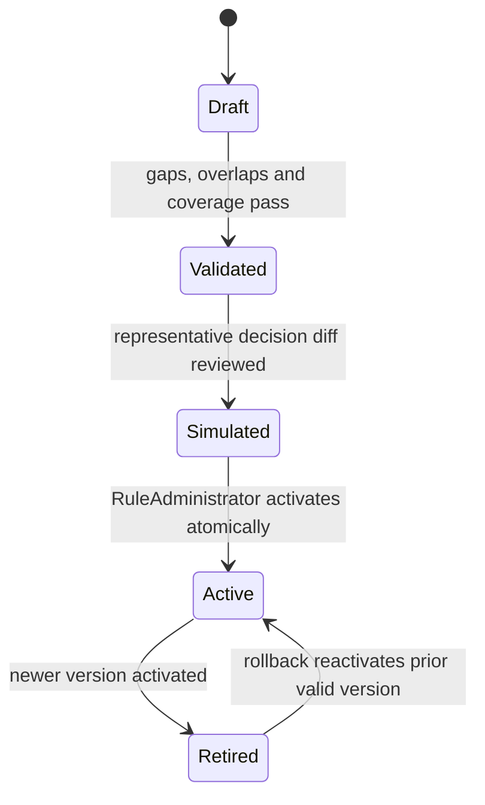

# Architecture Diagrams

These diagrams are deliberately maintained as Mermaid source instead of
AI-generated artwork. They stay accurate, reviewable, editable, and render
directly in GitHub Markdown.

## 1. System and deployment context

Design note: the local reviewer flow replaces only the external identity
provider. It does not replace server authorization, routing, persistence, or
audit behavior.

## 2. Code dependency direction

Design note: runtime collaboration and compile-time dependency direction are
different. Infrastructure depends on interfaces owned by Application; the pure
domain knows nothing about HTTP, XML, EF Core, PostgreSQL, React, or identity.

## 3. Manual parcel decision

Design note: the browser never calculates a route. The same idempotency key
with changed facts is rejected rather than silently returning the wrong result.

## 4. XML import and durable processing

Design note: a supported document isolates invalid rows. Malformed XML,
wrong roots, DTD/XXE, and document-wide limits reject the whole upload because a
safe document boundary cannot be established.

## 5. Insurance is a workflow hold

Design note: insurance approval never changes the intended department and
never rewrites the historical routing decision.

## 6. Controlled rule lifecycle

Design note: rollback means reactivating an immutable prior version.
Historical decisions keep the version and explanations that originally
produced them.
